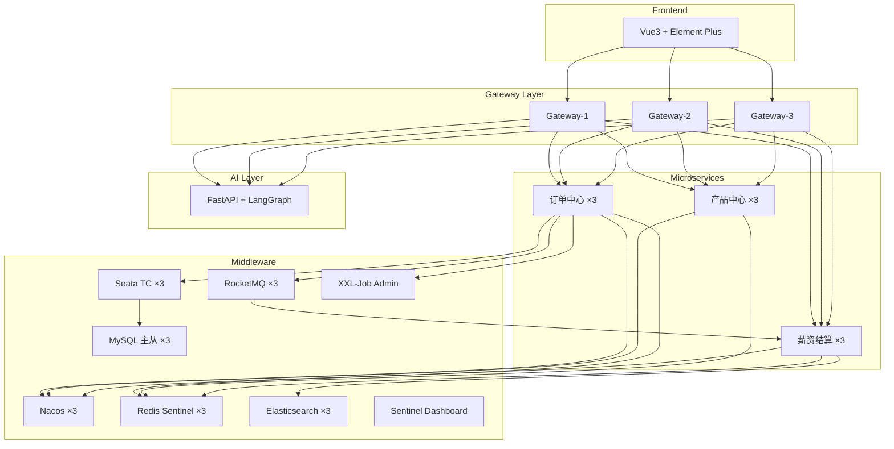

# 外服人事调派订单

## 一、项目业务概览

> 面试笔记
>
> /Users/yihao/Folder/Work/GitHub/Obsidian/Sun Yihao’s Pages/04.Java/02.Interview/00.Project/00.外服人事调派订单系统.md
>
> 可以结合 02.Interview 文件夹下的内容进行开发

```
入职订单创建
  → Gateway JWT 鉴权
  → 订单中心校验业务状态
  → Seata AT 开启全局事务
  → 创建订单并推进状态 CREATED → PROCESSING
  → 产品中心扣减产品名额 / 服务额度
  → 订单进入 WAIT_EXTERNAL_SYNC，并写入三方同步 Outbox
  → Seata 提交 / 回滚
  → Outbox 定时投递三方同步 RocketMQ 消息
  → 调用第三方外服/福利供应商接口同步订单
  → 三方同步成功后记录 third_sync_status = SUCCESS
  → 订单进入 PENDING_PAYMENT，并写入结算 Outbox
  → Outbox 定时投递结算 RocketMQ 消息
  → 薪资结算中心消费消息
  → 幂等生成 PENDING 账单并计算金额
  → 用户支付账单后，账单 PAID 并反写订单 SETTLED
```

**3 个核心微服务**：订单中心、产品中心（名额/福利管理）、薪资结算中心

> [!NOTE]
> 当前已落地的订单类型是 `ONBOARD` 入职。调动、离职后续应作为独立业务流扩展，不能复用入职扣减产品名额的链路硬套。

---

## 二、技术架构总览



---

## 三、资源评估（3 节点模式）

### 3.1 中间件资源

| 组件 | 节点数 | 单节点内存 | 小计 | ARM 兼容 |
|------|--------|-----------|------|----------|
| **Nacos** | 3 | 384MB | 1.2GB | ✅ |
| **MySQL**（1主2从） | 3 | 384MB | 1.2GB | ✅ |
| **Redis** Sentinel | 3+3哨兵 | 64MB / 32MB | 288MB | ✅ |
| **RocketMQ** NameSrv | 2 | 256MB | 512MB | ✅ |
| **RocketMQ** Broker | 3 | 384MB | 1.2GB | ✅ |
| **Seata** TC | 3 | 256MB | 768MB | ✅ |
| **Elasticsearch** | 3 | 512MB | 1.5GB | ✅ |
| **Sentinel** Dashboard | 1 | 256MB | 256MB | ✅ |
| **XXL-Job** Admin | 1 | 256MB | 256MB | ✅ |
| **ShardingSphere-Proxy** | 1 | 512MB | 512MB | ✅ |
| **小计** | — | — | **~7.7GB** | — |

### 3.2 微服务资源

| 服务 | 节点数 | 单节点内存 | 小计 |
|------|--------|-----------|------|
| **Spring Cloud Gateway** | 3 | 256MB | 768MB |
| **订单中心** order-service | 3 | 384MB | 1.2GB |
| **产品中心** product-service | 3 | 384MB | 1.2GB |
| **薪资结算** settlement-service | 3 | 384MB | 1.2GB |
| **小计** | — | — | **~4.4GB** |

### 3.3 前端 & AI

| 组件 | 节点数 | 内存 |
|------|--------|------|
| **Vue3**（Nginx） | 1 | 64MB |
| **FastAPI + LangGraph** | 1 | 512MB |
| **小计** | — | **~576MB** |

### 3.4 总计

| 类别 | 内存 |
|------|------|
| 中间件 | ~7.7GB |
| 微服务 | ~4.4GB |
| 前端 & AI | ~0.6GB |
| OrbStack 开销 | ~1GB |
| **总计** | **~13.7GB** |
| 你的机器 | **64GB** |
| **剩余** | **~50GB** |

> [!TIP]
> 64GB 内存非常充裕。即使后续加入 Kibana、Grafana + Prometheus 监控栈，也完全没有压力。

### 3.5 磁盘评估

| 项目 | 预估占用 |
|------|---------|
| Docker 镜像（全部） | ~15GB |
| MySQL 数据（含千万级 mock） | ~10-20GB |
| ES 索引数据 | ~5GB |
| RocketMQ 消息存储 | ~2GB |
| 日志 | ~5GB |
| **总计** | **~40-50GB** |

1TB SSD 完全够用。

---

## 四、面试知识点 → 项目模块映射

> [!IMPORTANT]
> 这是这个项目最核心的价值。下表区分“已落地”和“规划/可扩展”，面试时可以明确说明哪些是当前代码证据，哪些是生产演进方案。

### 4.1 分布式事务 → Seata AT

| 面试知识点 | 状态 | 项目中的体现 |
|-----------|------|-------------|
| Seata 四种模式（AT/TCC/Saga/XA） | 已落地 | 订单创建 + 产品名额扣减使用 AT 模式 |
| `@GlobalTransactional` 注解 | 已落地 | 订单中心入职流程的核心事务注解 |
| Undo Log 原理 | 已落地 | 可在 MySQL 中直接查看 undo_log 表 |
| TC/TM/RM 三个角色 | 已落地 | Seata Server（TC）+ 各微服务（TM/RM） |
| 全局锁与写隔离 | 已落地 | 并发入职场景下观察全局锁行为 |
| 为什么不用 TCC | 面试说明 | 对比实现成本：AT 无侵入，TCC 需写 Try/Confirm/Cancel |
| 外部三方同步边界 | 已落地 | 产品扣减成功后异步调用三方接口，订单主状态与 `third_sync_status` 分离 |

### 4.2 消息队列 → RocketMQ

| 面试知识点 | 状态 | 项目中的体现 |
|-----------|------|-------------|
| 本地消息表（Outbox） | 已落地 | 入职核心事务内写入三方同步事件；三方成功后写入结算事件，后台任务可靠投递 |
| 三方同步最终一致 | 已落地 | 核心事务成功后由 Outbox 投递三方同步消息，失败由 MQ 重试、状态和人工补偿兜底 |
| 结算消息可靠性 | 已落地 | 三方成功后在订单库写入 Outbox 本地消息表，定时补偿任务投递结算 Topic，投递成功后标记 `SENT` |
| 消费者幂等 | 已落地 | `t_bill.order_no` 唯一约束兜底，重复消费捕获唯一键后按成功处理 |
| 消息堆积处理 | 面试说明 | 文档中说明发薪日扩容 Consumer、增加 Queue、上游限速、批量消费 |
| 顺序消息 vs 并发消费 | 面试说明 | 结算场景选择并发消费；若同一订单多次变更，可按订单 ID 使用顺序消息 |
| 死信队列 & 重试机制 | 已落地基础 | 消费异常触发 RocketMQ 重试，最终失败进入人工处理状态 |
| 削峰填谷 | 已落地基础 | 月底结算通过 RocketMQ 解耦订单链路和账单生成 |

### 4.3 分布式锁 → Redis / Redisson

| 面试知识点 | 状态 | 项目中的体现 |
|-----------|------|-------------|
| Redisson 分布式锁 | 已落地 | 入职、产品扣减、账单支付使用业务维度锁 |
| Watchdog 自动续期 | 已落地 | 支付链路使用 `leaseTime = -1` 触发 Redisson Watchdog |
| 锁 + DB 唯一约束双重保证 | 已落地 | 账单生成依赖唯一约束兜底，支付依赖锁和状态机幂等 |
| Redis Sentinel 高可用 | 规划/部署演进 | 当前本地 compose 使用 Redis 主从演示，生产可扩展 Sentinel/Cluster |
| 缓存穿透/击穿/雪崩 | 规划/面试说明 | 产品信息缓存策略可作为后续扩展 |

### 4.4 数据库 → MySQL + ShardingSphere

| 面试知识点 | 状态 | 项目中的体现 |
|-----------|------|-------------|
| 主从复制 | 部署演示 | Docker 编排包含 MySQL 主从节点，业务读写分离仍可继续补充 |
| 分库分表策略 | 规划/面试说明 | 文档中说明按企业 ID 分库、按时间/哈希分表，当前代码未接 ShardingSphere |
| 冷热数据分离 | 规划/面试说明 | 文档中说明历史表归档和冷数据下沉，当前代码未接归档任务 |
| SQL 优化 | 已落地基础 | 订单号、员工 ID、账单订单号等核心索引已建 |
| MVCC | 面试说明 | 可结合 MySQL InnoDB 并发订单查询场景说明 |
| 千万级数据 Mock | 规划 | 可后续补数据生成脚本和压测报告 |

### 4.5 微服务治理 → Spring Cloud Alibaba

| 面试知识点 | 状态 | 项目中的体现 |
|-----------|------|-------------|
| Nacos 注册中心 & 配置中心 | 已落地 | 所有服务注册，配置通过 Nacos DataId 管理 |
| Gateway 网关路由 | 已落地 | 统一入口、路由转发、JWT 鉴权 |
| Sentinel 限流降级 | 规划 | 可后续补接口限流和 Feign 熔断降级 |
| OpenFeign 服务调用 | 已落地 | 订单中心调用产品中心，结算中心反查/反写订单 |
| 负载均衡（LoadBalancer） | 已落地基础 | Gateway/Feign 通过服务名调用，依赖 Spring Cloud LoadBalancer |

### 4.6 搜索 → Elasticsearch

| 面试知识点 | 状态 | 项目中的体现 |
|-----------|------|-------------|
| 倒排索引原理 | 规划/面试说明 | 当前代码未接 Elasticsearch |
| MySQL 数据同步到 ES | 规划/面试说明 | 可采用 Canal / MQ 同步方案 |
| 分片与副本 | 规划/面试说明 | 生产可按数据量配置 ES 分片副本 |

### 4.7 异步编程 → CompletableFuture

| 面试知识点 | 状态 | 项目中的体现 |
|-----------|------|-------------|
| 异步并行计算 | 已落地 | 结算报表接口使用 `CompletableFuture` 并行统计账单数据 |
| 自定义线程池隔离 | 已落地 | `settlementReportExecutor` 隔离报表线程，避免占用公共线程池 |
| thenCombine / allOf | 已落地基础 | 报表聚合使用 `CompletableFuture.allOf` 等待多个统计任务 |

### 4.8 AI → FastAPI + LangGraph

| 面试知识点 | 项目中的体现 |
|-----------|-------------|
| RAG 检索增强生成 | HR 业务知识库问答 |
| LangGraph 状态图 | 意图识别 → 工具调用 → 回答生成 |
| Agent 工具调用 | 查询订单状态、员工信息等 |

### 4.9 其他高频面试点

| 面试知识点 | 状态 | 项目中的体现 |
|-----------|------|-------------|
| 定时任务（XXL-Job） | 已落地基础 / 规划增强 | 当前使用 Spring Schedule 补偿投递 Outbox；生产可迁移 XXL-Job 统一调度 |
| 设计模式 | 已落地基础 | 订单状态机、计费规则预留策略扩展点 |
| 接口幂等性 | 已落地 | 入职、产品扣减、账单生成、账单支付均有幂等控制 |
| 高可用系统设计 | 已落地基础 | 网关、Nacos、MQ、重试和人工补偿入口已有基础 |
| 乐观锁/悲观锁 | 已落地基础 | 产品名额扣减通过 Redisson 锁串行化同产品扣减 |
| 线程池 | 已落地 | 异步结算报表线程池配置 |
| **开发规范** | **每完成一个子项必须进行阶段性总结 (Summary Requirement)** |

---

## 五、项目目录结构设计

```
/Users/yihao/Folder/Work/GitHub/all-in-one/
├── docker/                          # Docker 编排
│   ├── docker-compose.yml           # 主编排文件
│   ├── docker-compose.infra.yml     # 中间件集群
│   ├── docker-compose.app.yml       # 微服务
│   ├── docker-compose.ai.yml        # AI 服务
│   ├── mysql/                       # MySQL 主从配置
│   ├── redis/                       # Redis Sentinel 配置
│   ├── nacos/                       # Nacos 集群配置
│   ├── rocketmq/                    # RocketMQ 配置
│   ├── seata/                       # Seata TC 配置
│   ├── elasticsearch/               # ES 集群配置
│   └── scripts/                     # 初始化 & Mock 数据脚本
│
├── front-end/                       # Vue3 前端
│   ├── src/
│   │   ├── views/
│   │   │   ├── order/               # 订单管理
│   │   │   ├── product/             # 产品管理
│   │   │   ├── settlement/          # 薪资结算
│   │   │   ├── employee/            # 员工管理
│   │   │   └── ai-chat/             # AI 客服
│   │   ├── api/                     # 接口层
│   │   ├── store/                   # 状态管理 (Pinia)
│   │   └── router/
│   └── package.json
│
├── back-end/                        # Spring Boot 后端
│   ├── uno-gateway/                 # Spring Cloud Gateway
│   ├── uno-auth/                    # 认证中心 (JWT 安全入口)
│   ├── uno-order/                   # 订单中心 (入职/调岗流程)
│   │   ├── uno-order-api/           # 对外 API (Feign 接口)
│   │   └── uno-order-service/       # 业务实现
│   ├── uno-product/                 # 产品中心 (福利/名额管理)
│   │   ├── uno-product-api/
│   │   └── uno-product-service/
│   ├── uno-settlement/              # 薪资结算中心
│   │   ├── uno-settlement-api/
│   │   └── uno-settlement-service/
│   ├── uno-common/                  # 公共模块
│   └── pom.xml                      # 父 POM
│
└── ai/                              # AI 服务
    ├── app/
    │   ├── agent/                   # LangGraph Agent
    │   ├── rag/                     # RAG 检索
    │   ├── tools/                   # 工具函数
    │   └── main.py                  # FastAPI 入口
    ├── knowledge/                   # 知识库文档
    ├── requirements.txt
    └── Dockerfile
```

---

## 六、分阶段实施建议

### Phase 1：基础设施（1-2 天）
- [x] Docker Compose 编排所有中间件（Nacos×3, MySQL 主从, Redis Sentinel, RocketMQ, Seata TC）
- [x] 验证所有中间件集群健康
- [x] 准备数据库初始化脚本

### Phase 2：核心微服务骨架（2-3 天）
- [x] 搭建 Spring Boot 父工程 + 公共模块 (`uno-common`)
- [x] 实现 Gateway + Nacos 注册发现 (`uno-gateway`)
- [x] 引入安全模块，落地认证中心及 JWT 鉴权 (`uno-auth` 额外加固)
- [x] 订单中心 CRUD + 状态机 (`uno-order`)
- [x] 产品/福利中心 CRUD + 名额管理 (`uno-product`)
- [x] 薪资结算中心基础框架 (`uno-settlement`)

### Phase 3：核心链路打通（3-5 天）- ✅ 已通关
- [x] Seata AT 分布式事务：入职 = 订单创建 + 名额扣减
- [x] Outbox 可靠消息：入职成功 → 三方同步消息；三方成功 → 结算消息
- [x] 结算消费者：幂等消费 + 唯一约束 + 异常防阻塞逻辑
- [x] 订单状态闭环：`CREATED -> PROCESSING -> WAIT_EXTERNAL_SYNC -> PENDING_PAYMENT -> SETTLED`
- [x] 支付闭环：账单 `PENDING -> PAID` 后通过 Feign 反写订单 `SETTLED`
- [x] 补生成账单兜底入口：仅接收 `orderNo`，后端回查订单服务并校验待支付状态

### Phase 4：高并发与幂等加固（2-3 天）
- [x] Redisson 分布式锁：解决入职抢单并发问题 (Done)
- [x] 接口幂等性通用组件设计 (Done)
- [x] 重复入职前置拦截：同一员工已有入职订单时，不再进入 MQ/Seata 回滚流程
- [ ] ShardingSphere 分库分表配置
- [ ] 千万级 Mock 数据脚本
- [ ] ES 搜索 + 数据同步
- [ ] Sentinel 限流降级规则
- [ ] XXL-Job 定时结算任务
- [ ] CompletableFuture 异步并行

### Phase 5：前端 & AI（2-3 天）
- [x] Vue3 管理后台（登录、仪表盘、订单、产品、结算、员工、AI 入口）
- [x] Element Plus + vue-i18n 国际化接入，系统名统一为“外服人事调派订单系统”
- [x] FastAPI + LangGraph AI Agent 骨架
- [ ] RAG 知识库问答
- [ ] AI 工具调用鉴权与真实业务查询增强

### Phase 6：可观测性（可选，1-2 天）
- [ ] ELK 日志收集
- [ ] Prometheus + Grafana 监控
- [ ] SkyWalking 链路追踪

---

## 七、当前落地架构与开发规范

### 7.1 微服务骨架

项目采用 Spring Boot 3 + Spring Cloud Alibaba + Java 21 的父工程结构，模块统一以 `uno-` 为前缀：

- `uno-common`：公共返回体、异常、JWT、Redisson 分布式锁、幂等组件、结算消息 DTO。
- `uno-gateway`：统一入口、Nacos 服务发现、JWT 鉴权、CORS。
- `uno-auth`：登录、JWT 签发、员工账号管理。当前阶段复用 `sys_user` 作为员工主数据。
- `uno-order`：订单创建、状态推进、Seata 事务入口、Outbox 可靠消息投递。
- `uno-product`：产品/福利管理、产品名额扣减、锁与幂等。
- `uno-settlement`：结算账单生成、支付确认、补生成账单兜底入口。

统一开发规范：

- Web 层统一返回 `Result<T>`。
- 业务异常统一抛 `UnoException`，由全局异常处理器转为标准响应。
- 跨服务同步调用使用 OpenFeign。
- 服务注册发现使用 Nacos。
- 订单与产品的强一致链路使用 Seata AT。
- 订单成功后的三方同步和账单生成使用 Outbox + RocketMQ 实现最终一致。

### 7.2 认证与网关链路

认证中心定位为统一看门人：

```text
前端登录
  -> POST /api/auth/login
  -> Vite proxy 转发到 Gateway 8080
  -> Gateway 白名单放行 /auth/login
  -> uno-auth 校验 sys_user
  -> JwtUtils 签发 JWT
  -> 前端保存 token
  -> 后续请求统一携带 Authorization: Bearer <token>
```

当前网关路由：

- `/auth/**` -> `uno-auth`
- `/order/**` -> `uno-order`
- `/product/**` -> `uno-product`
- `/settlement/**` -> `uno-settlement`

### 7.3 当前落地数据库

当前代码使用演示库名：

| 数据库 | 归属服务 | 当前主要表 |
|--------|----------|------------|
| `uno_auth` | 认证/员工账号 | `sys_user` |
| `uno_order` | 订单中心 | `t_order`, `undo_log` |
| `uno_product` | 产品中心 | `t_product`, `undo_log` |
| `uno_settlement` | 结算中心 | `t_bill`, `undo_log` |

核心字段：

```sql
-- uno_auth.sys_user
id, username, password, real_name, status, role, create_time, update_time

-- uno_order.t_order
id, order_no, employee_id, product_id, order_type, status,
third_sync_status, third_request_id, third_response_code, third_sync_time, third_sync_msg, third_retry_count,
remark, create_time, update_time

-- uno_product.t_product
id, product_name, total_quota, used_quota, status, create_time, update_time

-- uno_settlement.t_bill
id, bill_no, order_no, employee_id, amount, bill_type, status, remark, create_time, update_time
```

关键约束：

- `t_order.uk_order_no`：订单号唯一。
- `t_bill.uk_order_no`：同一订单只允许一个账单，用于消费者幂等兜底。
- `undo_log`：Seata AT 模式回滚日志。

旧库迁移：

```sql
ALTER TABLE uno_order.t_order
  ADD COLUMN product_id bigint DEFAULT NULL COMMENT '关联产品/福利ID' AFTER employee_id;

ALTER TABLE uno_order.t_order
  MODIFY COLUMN status varchar(30) NOT NULL COMMENT '状态机: CREATED, PROCESSING, WAIT_EXTERNAL_SYNC, PENDING_PAYMENT, SETTLED, CLOSED, SYNC_FAILED',
  ADD COLUMN third_sync_status varchar(30) NOT NULL DEFAULT 'NOT_SYNCED' COMMENT '第三方同步状态: NOT_SYNCED, SYNCING, SUCCESS, FAILED' AFTER status,
  ADD COLUMN third_request_id varchar(64) DEFAULT NULL COMMENT '第三方请求流水号' AFTER third_sync_status,
  ADD COLUMN third_response_code varchar(32) DEFAULT NULL COMMENT '第三方响应码' AFTER third_request_id,
  ADD COLUMN third_sync_time datetime DEFAULT NULL COMMENT '第三方同步成功时间' AFTER third_response_code,
  ADD COLUMN third_sync_msg varchar(255) DEFAULT NULL COMMENT '第三方同步结果信息' AFTER third_sync_time,
  ADD COLUMN third_retry_count int NOT NULL DEFAULT 0 COMMENT '第三方同步重试次数' AFTER third_sync_msg;

ALTER TABLE uno_settlement.t_bill DROP INDEX idx_order_no;
ALTER TABLE uno_settlement.t_bill ADD UNIQUE KEY uk_order_no (order_no);
```

### 7.4 面试扩展数据库模型

后续若要贴近企业外服场景，可在当前演示表基础上扩展：

- 订单中心：`t_company`, `t_employee`, `t_local_message`。
- 产品中心：`t_product_quota`, `t_rate_rule`。
- 结算中心：`t_salary_detail`, `t_salary_detail_history`, `t_charge`, `t_invoice`, `t_idempotent`。

扩展设计原则：

- 使用 `company_id` 作为企业维度分片键。
- 订单号可携带 company 基因，便于 ShardingSphere 分库分表。
- 金额、费率、账单类型后续应迁移到账单规则表，例如 `t_bill_rule(product_id, bill_type, amount, currency, status)`。
- 收费、开票类外部三方调用应使用“分布式锁 + 唯一约束 + 状态机 + 结果回查”组合兜底。
- 订单主状态 `status` 只表达业务生命周期，外部供应商同步进度使用 `third_sync_status` 单独表达，避免把外部集成状态硬塞进订单状态机。

### 7.5 当前核心数据流

```text
前端创建入职订单
  -> Gateway JWT 鉴权
  -> Seata AT 开启全局事务
  -> uno_order.t_order 插入 CREATED
  -> 订单更新 PROCESSING
  -> Feign 调 uno-product 扣减 t_product.used_quota
  -> 订单更新 WAIT_EXTERNAL_SYNC
  -> 写入三方同步 Outbox 事件
  -> Seata 提交
  -> Outbox 定时投递 uno-external-sync-topic
  -> 调用第三方外服/福利供应商接口同步订单
  -> third_sync_status 更新 SUCCESS
  -> 订单更新 PENDING_PAYMENT
  -> 写入结算 Outbox 事件
  -> Outbox 定时投递 uno-settlement-topic
  -> uno-settlement 消费消息
  -> t_bill 幂等生成 PENDING 账单
  -> 用户标记账单已支付
  -> t_bill 更新 PAID
  -> Feign 反写订单 SETTLED
```

状态机语义：

```text
CREATED -> PROCESSING -> WAIT_EXTERNAL_SYNC -> PENDING_PAYMENT -> SETTLED -> CLOSED
```

- `WAIT_EXTERNAL_SYNC`：内部订单创建和产品名额扣减已完成，等待外部供应商同步。
- `PENDING_PAYMENT`：订单核心链路已完成，产品名额已扣减，账单待支付。
- `SETTLED`：账单已支付，订单结算闭环完成。

第三方同步状态语义：

```text
NOT_SYNCED -> SYNCING -> SUCCESS / FAILED
```

- `NOT_SYNCED`：订单尚未发起第三方同步。
- `SYNCING`：已开始调用第三方外服/福利供应商接口。
- `SUCCESS`：第三方确认同步成功，订单才允许进入 `PENDING_PAYMENT`。
- `FAILED`：第三方同步失败，订单保留在处理中或失败待补偿状态，后续通过重试任务、人工补偿或结果回查恢复。

设计取舍：

- `status` 表达订单生命周期，`third_sync_status` 表达外部系统集成进度，两者分离，避免状态机膨胀。
- 第三方接口不是本地数据库事务资源，不能依赖 Seata 回滚外部系统；真实生产应通过请求流水号、幂等键、结果回查和补偿任务兜底。
- 内部核心事务完成时会写入三方同步 Outbox：订单推进到 `WAIT_EXTERNAL_SYNC` 和三方同步事件落库在同一个 Seata 全局事务内完成。
- 三方同步成功后的结算事件已经使用 Outbox 本地消息表兜底：订单状态推进到 `PENDING_PAYMENT` 和写入 `t_order_outbox` 在同一个本地事务内完成，后台补偿任务负责投递结算 Topic。

### 7.6 Seata 与 RocketMQ 边界

- Seata AT：负责订单中心和产品中心之间的同步强一致链路。
- 第三方接口：位于订单与产品强一致链路之后，使用独立同步状态和幂等流水号记录结果；外部系统失败时走补偿，不把外部接口纳入 Seata 回滚范围。
- RocketMQ：负责三方同步和结算通知的异步解耦；消息可靠性由 Outbox 扫描补偿兜底。
- Outbox：负责“数据库状态变更 + 待发送消息落库”的原子性，避免核心事务提交后 MQ 临时不可用导致消息丢失。
- 结算消费者通过 `orderNo` 幂等检查和数据库唯一约束防重复生成账单。

### 7.7 结算与补生成账单

正常账单由 MQ 自动生成，结算页的“补生成账单”不是日常入口，只用于：

- MQ 消息未被消费。
- 历史订单迁移后缺账单。
- 人工修复待支付订单账单数据。

补账单接口：

```http
POST /settlement/orders/{orderNo}/rebuild-bill
```

后端校验：

- 订单存在。
- 订单类型为 `ONBOARD`。
- 订单状态为 `PENDING_PAYMENT`。
- 该订单尚未存在账单。

### 7.8 前端与 AI

前端管理台能力：

- 登录、JWT 持久化、请求拦截。
- 仪表盘、订单管理、产品配额、薪资结算、员工管理、AI 聊天入口。
- Element Plus + vue-i18n 国际化，分页等组件使用 Element Plus locale。
- 系统名、面包屑、浏览器标题统一为“外服人事调派订单系统”。

AI 服务：

- FastAPI 入口。
- LangGraph Agent 骨架。
- RAG 检索模块骨架。
- 工具调用包括订单查询、近期订单、员工资格检查、HR 知识库查询。

### 7.9 联调步骤

1. 登录 `admin / 123456`。
2. 进入产品配额，确认产品 `101/102` 存在且有剩余额度。
3. 进入订单管理，创建入职订单，选择员工和产品。
4. 订单应先显示“待支付”，并展示产品名。
5. 产品 `used_quota` 增加 1。
6. 进入薪资结算，账单应自动出现，状态为“待支付”，类型为“入职服务费”。
7. 点击“标记为已支付”，账单变“已支付”，订单状态变“已结算”。
8. 同一员工再次创建入职订单，应只提示“该员工已存在入职订单，不能重复入职”。

### 7.10 验证命令

后端编译：

```bash
cd /Users/yihao/Folder/Work/GitHub/all-in-one/back-end
mvn -pl uno-order/uno-order-service,uno-settlement/uno-settlement-service -am -DskipTests compile
```

前端构建：

```bash
cd /Users/yihao/Folder/Work/GitHub/all-in-one/front-end
npm run build
```

---

## 八、千万级数据 Mock 策略

```sql
-- 示例：批量插入订单数据（每批 5000 条，循环 2000 次 = 1000 万条）
DELIMITER $$
CREATE PROCEDURE mock_orders(IN batch_count INT)
BEGIN
    DECLARE i INT DEFAULT 0;
    WHILE i < batch_count DO
        INSERT INTO t_order (order_no, employee_id, order_type, status, ...)
        SELECT
            CONCAT('ORD', LPAD(FLOOR(RAND()*100000000), 10, '0')),
            FLOOR(RAND()*1000000) + 1,
            ELT(FLOOR(RAND()*3)+1, 'ONBOARD','TRANSFER','RESIGN'),
            ELT(FLOOR(RAND()*4)+1, 'CREATED','PROCESSING','SETTLED','CLOSED'),
            ...
        FROM seq_5000;  -- 辅助序列表
        SET i = i + 1;
        -- 每批提交，避免大事务
        COMMIT;
    END WHILE;
END$$
```

> [!TIP]
> 也可以用 Java 程序（多线程 + 批量 INSERT）或 Python Faker 库生成更真实的数据。

---

## 九、风险与应对

| 风险 | 概率 | 应对 |
|------|------|------|
| 容器太多导致启动慢 | 中 | 分组启动：先 infra → 再 app → 最后 ai |
| RocketMQ 3 Broker 内存偏高 | 低 | 调低 JVM 堆内存 `-Xmx256m`，Demo 够用 |
| ES 3 节点吃内存 | 中 | 设置 `-Xms256m -Xmx512m`，关闭 ML 插件 |
| ShardingSphere-Proxy 兼容性 | 低 | 可先用 ShardingSphere-JDBC 嵌入式 |
| 全量启动超 20GB 内存 | 低 | 64GB 充裕，实测再调整 |

---

## 十、总结

| 维度 | 评估 |
|------|------|
| **硬件可行性** | ✅ 64GB 内存非常充裕，M1 Max 性能强劲 |
| **软件兼容性** | ✅ 所有组件均有 ARM64 镜像 |
| **面试知识覆盖** | ✅ 覆盖 90%+ 的面试知识点 |
| **实施复杂度** | ⚠️ 中等偏高，但分阶段可控 |
| **学习价值** | ✅ 极高，每个技术点都有实战场景 |
| **预估总工期** | 10-15 天（全职投入） |
