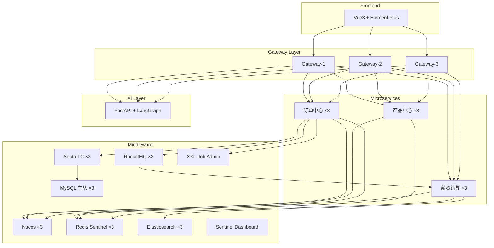

# 外服人事调派订单系统 — Demo 项目可行性分析

## 结论：✅ 完全可行

> [!IMPORTANT]
> MacBook M1 Max / 64GB / 1TB + OrbStack 完全能跑起这套架构。预估总内存占用 **15–20GB**，占总内存 25–30%，留有充足余量。

---

## 一、项目业务概览（来自面试笔记）

```
入职 / 调派订单创建
  → 订单中心校验业务状态
  → Seata AT 开启全局事务
  → 更新订单状态
  → 产品中心扣减产品名额 / 服务额度
  → Seata 提交 / 回滚
  → 发送 RocketMQ 结算消息
  → 薪资结算中心消费消息
  → 生成账单、计算薪资
```

**3 个核心微服务**：订单中心、产品中心、薪资结算中心

---

## 二、技术架构总览



---

## 三、资源评估（3 节点模式）

### 3.1 中间件资源

| 组件 | 节点数 | 单节点内存 | 小计 | ARM 兼容 |
|------|--------|-----------|------|----------|
| **Nacos** | 3 | 384MB | 1.2GB | ✅ |
| **MySQL**（1主2从） | 3 | 384MB | 1.2GB | ✅ |
| **Redis** Sentinel | 3+3哨兵 | 64MB / 32MB | 288MB | ✅ |
| **RocketMQ** NameSrv | 2 | 256MB | 512MB | ✅ |
| **RocketMQ** Broker | 3 | 384MB | 1.2GB | ✅ |
| **Seata** TC | 3 | 256MB | 768MB | ✅ |
| **Elasticsearch** | 3 | 512MB | 1.5GB | ✅ |
| **Sentinel** Dashboard | 1 | 256MB | 256MB | ✅ |
| **XXL-Job** Admin | 1 | 256MB | 256MB | ✅ |
| **ShardingSphere-Proxy** | 1 | 512MB | 512MB | ✅ |
| **小计** | — | — | **~7.7GB** | — |

### 3.2 微服务资源

| 服务 | 节点数 | 单节点内存 | 小计 |
|------|--------|-----------|------|
| **Spring Cloud Gateway** | 3 | 256MB | 768MB |
| **订单中心** order-service | 3 | 384MB | 1.2GB |
| **产品中心** product-service | 3 | 384MB | 1.2GB |
| **薪资结算** settlement-service | 3 | 384MB | 1.2GB |
| **小计** | — | — | **~4.4GB** |

### 3.3 前端 & AI

| 组件 | 节点数 | 内存 |
|------|--------|------|
| **Vue3**（Nginx） | 1 | 64MB |
| **FastAPI + LangGraph** | 1 | 512MB |
| **小计** | — | **~576MB** |

### 3.4 总计

| 类别 | 内存 |
|------|------|
| 中间件 | ~7.7GB |
| 微服务 | ~4.4GB |
| 前端 & AI | ~0.6GB |
| OrbStack 开销 | ~1GB |
| **总计** | **~13.7GB** |
| 你的机器 | **64GB** |
| **剩余** | **~50GB** |

> [!TIP]
> 64GB 内存非常充裕。即使后续加入 Kibana、Grafana + Prometheus 监控栈，也完全没有压力。

### 3.5 磁盘评估

| 项目 | 预估占用 |
|------|---------|
| Docker 镜像（全部） | ~15GB |
| MySQL 数据（含千万级 mock） | ~10-20GB |
| ES 索引数据 | ~5GB |
| RocketMQ 消息存储 | ~2GB |
| 日志 | ~5GB |
| **总计** | **~40-50GB** |

1TB SSD 完全够用。

---

## 四、面试知识点 → 项目模块映射

> [!IMPORTANT]
> 这是这个项目最核心的价值——每一个技术知识点都能在项目中找到对应的实战场景。

### 4.1 分布式事务 → Seata AT

| 面试知识点 | 项目中的体现 |
|-----------|-------------|
| Seata 四种模式（AT/TCC/Saga/XA） | 订单创建 + 产品名额扣减使用 AT 模式 |
| `@GlobalTransactional` 注解 | 订单中心入职流程的核心事务注解 |
| Undo Log 原理 | 可在 MySQL 中直接查看 undo_log 表 |
| TC/TM/RM 三个角色 | Seata Server（TC）集群 + 各微服务（TM/RM） |
| 全局锁与写隔离 | 并发入职场景下观察全局锁行为 |
| 为什么不用 TCC | 对比实现成本——AT 无侵入 vs TCC 需写 Try/Confirm/Cancel |

### 4.2 消息队列 → RocketMQ

| 面试知识点 | 项目中的体现 |
|-----------|-------------|
| 事务消息（Half Message） | 入职成功后发送结算消息 |
| 消费者幂等 | 结算中心通过唯一约束 + 状态机保证 |
| 消息堆积处理 | 模拟月底批量结算 10 万条消息场景 |
| 顺序消息 vs 并发消费 | 结算场景选择并发消费的原因分析 |
| 死信队列 & 重试机制 | 结算失败后的重试策略 |
| 削峰填谷 | 月底发薪日流量洪峰场景 |

### 4.3 分布式锁 → Redis / Redisson

| 面试知识点 | 项目中的体现 |
|-----------|-------------|
| Redisson 分布式锁 | 收费与开票环节防重复 |
| Watchdog 自动续期 | 长耗时开票场景下的锁续期 |
| 锁 + DB 唯一约束双重保证 | "Redisson 拦并发，DB 兜底" |
| Redis Sentinel 高可用 | 3 节点 Sentinel 模式 |
| 缓存穿透/击穿/雪崩 | 产品信息缓存策略 |

### 4.4 数据库 → MySQL + ShardingSphere

| 面试知识点 | 项目中的体现 |
|-----------|-------------|
| 主从复制 | 1 主 2 从架构，读写分离 |
| 分库分表策略 | ShardingSphere 按订单 ID hash 分片 |
| 冷热数据分离 | 历史订单归档到冷库 |
| SQL 优化 | 慢 SQL 分析、索引优化 |
| MVCC | 并发订单查询场景 |
| 千万级数据 Mock | 通过脚本批量插入模拟真实数据量 |

### 4.5 微服务治理 → Spring Cloud Alibaba

| 面试知识点 | 项目中的体现 |
|-----------|-------------|
| Nacos 注册中心 & 配置中心 | 所有服务注册 + 动态配置 |
| Gateway 网关路由 | 统一入口、路由转发、鉴权 |
| Sentinel 限流降级 | 接口 QPS 限流 + 熔断 |
| OpenFeign 服务调用 | 订单中心调用产品中心 |
| 负载均衡（Ribbon/LoadBalancer） | 3 节点服务的请求分发 |

### 4.6 搜索 → Elasticsearch

| 面试知识点 | 项目中的体现 |
|-----------|-------------|
| 倒排索引原理 | 订单/员工全文搜索 |
| MySQL 数据同步到 ES | Canal / 双写方案 |
| 分片与副本 | 3 节点集群配置 |

### 4.7 异步编程 → CompletableFuture

| 面试知识点 | 项目中的体现 |
|-----------|-------------|
| 异步并行计算 | 结算时并行查询社保、个税、汇率 |
| thenCombine / allOf | 多数据源聚合 |

### 4.8 AI → FastAPI + LangGraph

| 面试知识点 | 项目中的体现 |
|-----------|-------------|
| RAG 检索增强生成 | HR 业务知识库问答 |
| LangGraph 状态图 | 意图识别 → 工具调用 → 回答生成 |
| Agent 工具调用 | 查询订单状态、员工信息等 |

### 4.9 其他高频面试点

| 面试知识点 | 项目中的体现 |
|-----------|-------------|
| 定时任务（XXL-Job） | 月底批量结算触发 |
| 设计模式 | 状态模式（订单状态机）、策略模式（薪资计算）、模板方法 |
| 接口幂等性 | 全链路幂等设计 |
| 高可用系统设计 | 限流、熔断、降级、重试 |
| 乐观锁/悲观锁 | 产品名额扣减场景 |
| 线程池 | 异步结算线程池配置 |

---

## 五、项目目录结构设计

```
/Users/yihao/Folder/Work/GitHub/all-in-one/
├── docker/                          # Docker 编排
│   ├── docker-compose.yml           # 主编排文件
│   ├── docker-compose.infra.yml     # 中间件集群
│   ├── docker-compose.app.yml       # 微服务
│   ├── docker-compose.ai.yml        # AI 服务
│   ├── mysql/                       # MySQL 主从配置
│   ├── redis/                       # Redis Sentinel 配置
│   ├── nacos/                       # Nacos 集群配置
│   ├── rocketmq/                    # RocketMQ 配置
│   ├── seata/                       # Seata TC 配置
│   ├── elasticsearch/               # ES 集群配置
│   └── scripts/                     # 初始化 & Mock 数据脚本
│
├── front-end/                       # Vue3 前端
│   ├── src/
│   │   ├── views/
│   │   │   ├── order/               # 订单管理
│   │   │   ├── product/             # 产品管理
│   │   │   ├── settlement/          # 薪资结算
│   │   │   ├── employee/            # 员工管理
│   │   │   └── ai-chat/             # AI 客服
│   │   ├── api/                     # 接口层
│   │   ├── store/                   # 状态管理 (Pinia)
│   │   └── router/
│   └── package.json
│
├── back-end/                        # Spring Boot 后端
│   ├── aio-gateway/                 # Spring Cloud Gateway
│   ├── aio-order/                   # 订单中心
│   │   ├── aio-order-api/           # 对外 API (Feign 接口)
│   │   └── aio-order-service/       # 业务实现
│   ├── aio-product/                 # 产品中心
│   │   ├── aio-product-api/
│   │   └── aio-product-service/
│   ├── aio-settlement/              # 薪资结算中心
│   │   ├── aio-settlement-api/
│   │   └── aio-settlement-service/
│   ├── aio-common/                  # 公共模块
│   └── pom.xml                      # 父 POM
│
└── ai/                              # AI 服务
    ├── app/
    │   ├── agent/                   # LangGraph Agent
    │   ├── rag/                     # RAG 检索
    │   ├── tools/                   # 工具函数
    │   └── main.py                  # FastAPI 入口
    ├── knowledge/                   # 知识库文档
    ├── requirements.txt
    └── Dockerfile
```

---

## 六、分阶段实施建议

### Phase 1：基础设施（1-2 天）
- [ ] Docker Compose 编排所有中间件（Nacos×3, MySQL 主从, Redis Sentinel, RocketMQ, Seata TC）
- [ ] 验证所有中间件集群健康
- [ ] 准备数据库初始化脚本

### Phase 2：核心微服务骨架（2-3 天）
- [ ] 搭建 Spring Boot 父工程 + 公共模块
- [ ] 实现 Gateway + Nacos 注册发现
- [ ] 订单中心 CRUD + 状态机
- [ ] 产品中心 CRUD + 名额管理
- [ ] 薪资结算中心基础框架

### Phase 3：核心链路打通（3-5 天）
- [ ] Seata AT 分布式事务：入职 = 订单创建 + 名额扣减
- [ ] RocketMQ 事务消息：入职成功 → 发送结算消息
- [ ] 结算消费者：幂等消费 + 唯一约束
- [ ] Redisson 分布式锁：开票防重

### Phase 4：高级特性（2-3 天）
- [ ] ShardingSphere 分库分表配置
- [ ] 千万级 Mock 数据脚本
- [ ] ES 搜索 + 数据同步
- [ ] Sentinel 限流降级规则
- [ ] XXL-Job 定时结算任务
- [ ] CompletableFuture 异步并行

### Phase 5：前端 & AI（2-3 天）
- [ ] Vue3 管理后台（订单、产品、结算页面）
- [ ] FastAPI + LangGraph AI Agent
- [ ] RAG 知识库问答

### Phase 6：可观测性（可选，1-2 天）
- [ ] ELK 日志收集
- [ ] Prometheus + Grafana 监控
- [ ] SkyWalking 链路追踪

---

## 七、OrbStack 特别注意事项

> [!NOTE]
> OrbStack 比 Docker Desktop 在 M1 上性能更好、资源占用更少，是最佳选择。

1. **ARM 镜像兼容**：所有主流中间件都有 `linux/arm64` 镜像，无需模拟 x86
2. **网络模式**：OrbStack 支持 `host.docker.internal`，服务间通信没问题
3. **文件系统**：OrbStack 的 VirtioFS 比 Docker Desktop 的文件映射快很多
4. **资源限制**：建议在 OrbStack 设置中给 VM 分配 **24-32GB 内存**，留一半给 macOS

---

## 八、千万级数据 Mock 策略

```sql
-- 示例：批量插入订单数据（每批 5000 条，循环 2000 次 = 1000 万条）
DELIMITER $$
CREATE PROCEDURE mock_orders(IN batch_count INT)
BEGIN
    DECLARE i INT DEFAULT 0;
    WHILE i < batch_count DO
        INSERT INTO t_order (order_no, employee_id, order_type, status, ...)
        SELECT
            CONCAT('ORD', LPAD(FLOOR(RAND()*100000000), 10, '0')),
            FLOOR(RAND()*1000000) + 1,
            ELT(FLOOR(RAND()*3)+1, 'ONBOARD','TRANSFER','RESIGN'),
            ELT(FLOOR(RAND()*4)+1, 'CREATED','PROCESSING','SETTLED','CLOSED'),
            ...
        FROM seq_5000;  -- 辅助序列表
        SET i = i + 1;
        -- 每批提交，避免大事务
        COMMIT;
    END WHILE;
END$$
```

> [!TIP]
> 也可以用 Java 程序（多线程 + 批量 INSERT）或 Python Faker 库生成更真实的数据。

---

## 九、风险与应对

| 风险 | 概率 | 应对 |
|------|------|------|
| 容器太多导致启动慢 | 中 | 分组启动：先 infra → 再 app → 最后 ai |
| RocketMQ 3 Broker 内存偏高 | 低 | 调低 JVM 堆内存 `-Xmx256m`，Demo 够用 |
| ES 3 节点吃内存 | 中 | 设置 `-Xms256m -Xmx512m`，关闭 ML 插件 |
| ShardingSphere-Proxy 兼容性 | 低 | 可先用 ShardingSphere-JDBC 嵌入式 |
| 全量启动超 20GB 内存 | 低 | 64GB 充裕，实测再调整 |

---

## 十、总结

| 维度 | 评估 |
|------|------|
| **硬件可行性** | ✅ 64GB 内存非常充裕，M1 Max 性能强劲 |
| **软件兼容性** | ✅ 所有组件均有 ARM64 镜像 |
| **面试知识覆盖** | ✅ 覆盖 90%+ 的面试知识点 |
| **实施复杂度** | ⚠️ 中等偏高，但分阶段可控 |
| **学习价值** | ✅ 极高，每个技术点都有实战场景 |
| **预估总工期** | 10-15 天（全职投入） |

> [!TIP]
> 建议从 **Phase 1 + Phase 2** 开始，先跑通基础设施和骨架，再逐步叠加高级特性。这样可以快速看到成果，保持学习动力。
