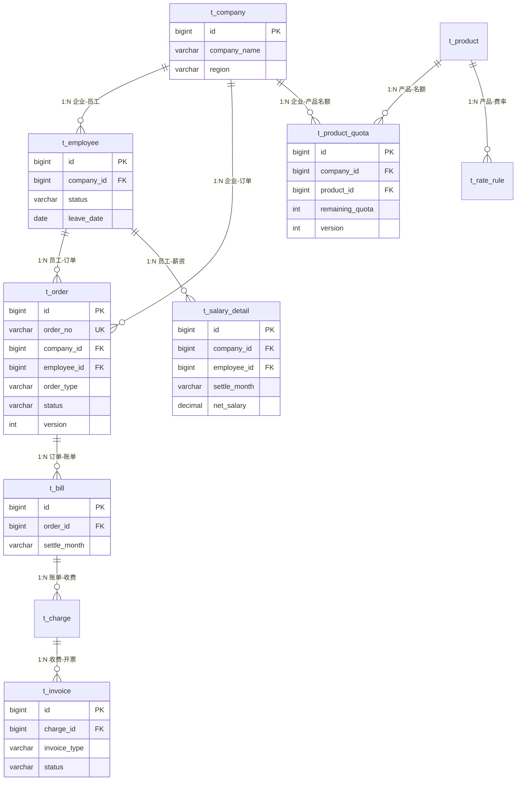

# 数据库表结构设计

## 一、数据库划分

| 数据库 | 归属服务 | 说明 |
|--------|---------|------|
| `db_order` | 订单中心 | 订单、员工、企业客户 |
| `db_product` | 产品中心 | 产品、名额、费率规则 |
| `db_settlement` | 薪资结算中心 | 薪资明细、账单、开票、收费 |

> 分片键统一使用 `company_id`（企业ID），与面试笔记中的 ShardingSphere 方案一致。

---

## 二、订单中心 (db_order)

### 2.1 企业客户表 t_company

```sql
CREATE TABLE t_company (
    id              BIGINT       PRIMARY KEY AUTO_INCREMENT,
    company_name    VARCHAR(200) NOT NULL COMMENT '企业名称',
    short_name      VARCHAR(50)  COMMENT '企业简称',
    contact_name    VARCHAR(50)  COMMENT '联系人',
    contact_phone   VARCHAR(20)  COMMENT '联系电话',
    contact_email   VARCHAR(100) COMMENT '联系邮箱',
    region          VARCHAR(20)  NOT NULL COMMENT '所属地区(CN/ID/SG等)',
    status          TINYINT      NOT NULL DEFAULT 1 COMMENT '1-启用 0-停用',
    created_by      VARCHAR(50),
    created_time    DATETIME     NOT NULL DEFAULT CURRENT_TIMESTAMP,
    updated_by      VARCHAR(50),
    updated_time    DATETIME     NOT NULL DEFAULT CURRENT_TIMESTAMP ON UPDATE CURRENT_TIMESTAMP,
    deleted         TINYINT      NOT NULL DEFAULT 0,
    KEY idx_region (region),
    KEY idx_status (status)
) COMMENT='企业客户表';
```

### 2.2 员工表 t_employee

```sql
CREATE TABLE t_employee (
    id              BIGINT       PRIMARY KEY AUTO_INCREMENT,
    employee_no     VARCHAR(32)  NOT NULL COMMENT '员工编号',
    company_id      BIGINT       NOT NULL COMMENT '所属企业ID(分片键)',
    name            VARCHAR(50)  NOT NULL COMMENT '姓名',
    id_card         VARCHAR(30)  COMMENT '身份证号',
    phone           VARCHAR(20)  COMMENT '手机号',
    email           VARCHAR(100) COMMENT '邮箱',
    department      VARCHAR(100) COMMENT '部门',
    position        VARCHAR(100) COMMENT '职位',
    entry_date      DATE         COMMENT '入职日期',
    leave_date      DATE         COMMENT '离职日期',
    status          TINYINT      NOT NULL DEFAULT 1 COMMENT '1-在职 2-离职 3-待入职',
    base_salary     DECIMAL(12,2) COMMENT '基本工资',
    created_by      VARCHAR(50),
    created_time    DATETIME     NOT NULL DEFAULT CURRENT_TIMESTAMP,
    updated_by      VARCHAR(50),
    updated_time    DATETIME     NOT NULL DEFAULT CURRENT_TIMESTAMP ON UPDATE CURRENT_TIMESTAMP,
    deleted         TINYINT      NOT NULL DEFAULT 0,
    UNIQUE KEY uk_employee_no (employee_no),
    KEY idx_company_id (company_id),
    KEY idx_company_status (company_id, status),
    KEY idx_name (name)
) COMMENT='员工表(累计200万+行)';
```

### 2.3 调派订单表 t_order

```sql
CREATE TABLE t_order (
    id              BIGINT       PRIMARY KEY AUTO_INCREMENT,
    order_no        VARCHAR(32)  NOT NULL COMMENT '订单编号(雪花算法,含company基因)',
    company_id      BIGINT       NOT NULL COMMENT '企业ID(分片键)',
    employee_id     BIGINT       NOT NULL COMMENT '员工ID',
    order_type      VARCHAR(20)  NOT NULL COMMENT 'ONBOARD-入职 TRANSFER-调派 RESIGN-离职 SALARY_ADJUST-调薪',
    status          VARCHAR(20)  NOT NULL DEFAULT 'CREATED' COMMENT 'CREATED/PROCESSING/COMPLETED/CANCELLED/FAILED',
    product_id      BIGINT       COMMENT '关联产品ID',
    effective_date  DATE         COMMENT '生效日期',
    remark          VARCHAR(500) COMMENT '备注',
    created_by      VARCHAR(50),
    created_time    DATETIME     NOT NULL DEFAULT CURRENT_TIMESTAMP,
    updated_by      VARCHAR(50),
    updated_time    DATETIME     NOT NULL DEFAULT CURRENT_TIMESTAMP ON UPDATE CURRENT_TIMESTAMP,
    deleted         TINYINT      NOT NULL DEFAULT 0,
    version         INT          NOT NULL DEFAULT 0 COMMENT '乐观锁版本号',
    UNIQUE KEY uk_order_no (order_no),
    KEY idx_company_id (company_id),
    KEY idx_employee_id (employee_id),
    KEY idx_company_status (company_id, status),
    KEY idx_created_time (created_time)
) COMMENT='调派订单表 — 面试点:状态机,Seata AT全局事务入口';
```

**面试知识点体现：**
- `status` 字段 → **状态机模式**（设计模式）
- `version` 字段 → **乐观锁**（高并发）
- `order_no` 含 company 基因 → **分库分表基因法**（ShardingSphere）
- 该表为 Seata AT 全局事务的 **TM（事务管理器）** 所在

### 2.4 本地消息表 t_local_message

```sql
CREATE TABLE t_local_message (
    id              BIGINT       PRIMARY KEY AUTO_INCREMENT,
    msg_id          VARCHAR(64)  NOT NULL COMMENT '消息唯一ID',
    biz_type        VARCHAR(30)  NOT NULL COMMENT '业务类型(SETTLEMENT/NOTIFY)',
    biz_key         VARCHAR(64)  NOT NULL COMMENT '业务键(order_no)',
    topic           VARCHAR(100) NOT NULL COMMENT 'MQ Topic',
    msg_body        TEXT         NOT NULL COMMENT '消息体JSON',
    status          TINYINT      NOT NULL DEFAULT 0 COMMENT '0-待发送 1-已发送 2-失败',
    retry_count     INT          NOT NULL DEFAULT 0 COMMENT '重试次数',
    max_retry       INT          NOT NULL DEFAULT 5,
    next_retry_time DATETIME     COMMENT '下次重试时间',
    created_time    DATETIME     NOT NULL DEFAULT CURRENT_TIMESTAMP,
    updated_time    DATETIME     NOT NULL DEFAULT CURRENT_TIMESTAMP ON UPDATE CURRENT_TIMESTAMP,
    UNIQUE KEY uk_msg_id (msg_id),
    KEY idx_status_retry (status, next_retry_time)
) COMMENT='本地消息表 — 面试点:RocketMQ事务消息兜底方案';
```

### 2.5 Seata Undo Log 表

```sql
CREATE TABLE undo_log (
    branch_id     BIGINT       NOT NULL COMMENT 'branch transaction id',
    xid           VARCHAR(128) NOT NULL COMMENT 'global transaction id',
    context       VARCHAR(128) NOT NULL COMMENT 'undo_log context,such as serialization',
    rollback_info LONGBLOB     NOT NULL COMMENT 'rollback info',
    log_status    INT          NOT NULL COMMENT '0:normal status,1:defense status',
    log_created   DATETIME(6)  NOT NULL,
    log_modified  DATETIME(6)  NOT NULL,
    UNIQUE KEY ux_undo_log (xid, branch_id)
) COMMENT='Seata AT模式undo_log — 面试点:AT自动回滚原理';
```

---

## 三、产品中心 (db_product)

### 3.1 产品表 t_product

```sql
CREATE TABLE t_product (
    id              BIGINT       PRIMARY KEY AUTO_INCREMENT,
    product_code    VARCHAR(32)  NOT NULL COMMENT '产品编码',
    product_name    VARCHAR(100) NOT NULL COMMENT '产品名称(社保代缴/公积金/薪资代发等)',
    category        VARCHAR(30)  NOT NULL COMMENT 'SOCIAL_SECURITY/HOUSING_FUND/PAYROLL/TAX',
    region          VARCHAR(20)  NOT NULL COMMENT '适用地区',
    unit_price      DECIMAL(12,2) COMMENT '单价(服务费/人/月)',
    status          TINYINT      NOT NULL DEFAULT 1 COMMENT '1-上架 0-下架',
    description     VARCHAR(500) COMMENT '产品描述',
    created_time    DATETIME     NOT NULL DEFAULT CURRENT_TIMESTAMP,
    updated_time    DATETIME     NOT NULL DEFAULT CURRENT_TIMESTAMP ON UPDATE CURRENT_TIMESTAMP,
    UNIQUE KEY uk_product_code (product_code),
    KEY idx_category (category),
    KEY idx_region (region)
) COMMENT='产品表 — 读多写少,适合缓存';
```

### 3.2 产品名额表 t_product_quota

```sql
CREATE TABLE t_product_quota (
    id              BIGINT       PRIMARY KEY AUTO_INCREMENT,
    company_id      BIGINT       NOT NULL COMMENT '企业ID',
    product_id      BIGINT       NOT NULL COMMENT '产品ID',
    total_quota     INT          NOT NULL COMMENT '总名额',
    used_quota      INT          NOT NULL DEFAULT 0 COMMENT '已用名额',
    remaining_quota INT          NOT NULL COMMENT '剩余名额',
    effective_start DATE         NOT NULL COMMENT '合同生效起始',
    effective_end   DATE         NOT NULL COMMENT '合同生效截止',
    version         INT          NOT NULL DEFAULT 0 COMMENT '乐观锁',
    created_time    DATETIME     NOT NULL DEFAULT CURRENT_TIMESTAMP,
    updated_time    DATETIME     NOT NULL DEFAULT CURRENT_TIMESTAMP ON UPDATE CURRENT_TIMESTAMP,
    UNIQUE KEY uk_company_product (company_id, product_id),
    KEY idx_company_id (company_id)
) COMMENT='产品名额表 — 面试点:Seata AT扣减,乐观锁防超卖';
```

**面试知识点体现：**
- `remaining_quota` → 入职时通过 **Seata AT** 与订单表原子扣减
- `version` → 防止并发超卖的 **乐观锁**
- 该表是 Seata AT 的 **RM（资源管理器）** 参与方

### 3.3 费率规则表 t_rate_rule

```sql
CREATE TABLE t_rate_rule (
    id              BIGINT       PRIMARY KEY AUTO_INCREMENT,
    product_id      BIGINT       NOT NULL COMMENT '产品ID',
    region          VARCHAR(20)  NOT NULL COMMENT '地区',
    rule_type       VARCHAR(30)  NOT NULL COMMENT 'SOCIAL_BASE/TAX_RATE/HOUSING_RATE',
    rule_name       VARCHAR(100) NOT NULL COMMENT '规则名称',
    rate_value      DECIMAL(8,4) COMMENT '费率值',
    min_base        DECIMAL(12,2) COMMENT '最低基数',
    max_base        DECIMAL(12,2) COMMENT '最高基数',
    effective_year  INT          NOT NULL COMMENT '生效年份',
    status          TINYINT      NOT NULL DEFAULT 1,
    created_time    DATETIME     NOT NULL DEFAULT CURRENT_TIMESTAMP,
    updated_time    DATETIME     NOT NULL DEFAULT CURRENT_TIMESTAMP ON UPDATE CURRENT_TIMESTAMP,
    KEY idx_product_region (product_id, region),
    KEY idx_year (effective_year)
) COMMENT='费率规则表 — 面试点:策略模式(不同地区不同计算规则)';
```

---

## 四、薪资结算中心 (db_settlement)

### 4.1 薪资明细表 t_salary_detail

```sql
CREATE TABLE t_salary_detail (
    id              BIGINT       PRIMARY KEY AUTO_INCREMENT,
    company_id      BIGINT       NOT NULL COMMENT '企业ID(分片键)',
    employee_id     BIGINT       NOT NULL COMMENT '员工ID',
    settle_month    VARCHAR(7)   NOT NULL COMMENT '结算月份(2026-05)',
    base_salary     DECIMAL(12,2) NOT NULL DEFAULT 0 COMMENT '基本工资',
    social_security DECIMAL(12,2) NOT NULL DEFAULT 0 COMMENT '社保(企业+个人)',
    housing_fund    DECIMAL(12,2) NOT NULL DEFAULT 0 COMMENT '公积金',
    tax_amount      DECIMAL(12,2) NOT NULL DEFAULT 0 COMMENT '个税',
    supplement      DECIMAL(12,2) NOT NULL DEFAULT 0 COMMENT '补发金额',
    deduction       DECIMAL(12,2) NOT NULL DEFAULT 0 COMMENT '扣减金额',
    net_salary      DECIMAL(12,2) NOT NULL DEFAULT 0 COMMENT '实发工资',
    status          VARCHAR(20)  NOT NULL DEFAULT 'PENDING' COMMENT 'PENDING/CALCULATING/SETTLED/PAID',
    created_time    DATETIME     NOT NULL DEFAULT CURRENT_TIMESTAMP,
    updated_time    DATETIME     NOT NULL DEFAULT CURRENT_TIMESTAMP ON UPDATE CURRENT_TIMESTAMP,
    UNIQUE KEY uk_employee_month (employee_id, settle_month),
    KEY idx_company_month (company_id, settle_month),
    KEY idx_settle_month (settle_month),
    KEY idx_status (status)
) COMMENT='薪资明细表(单表2000万+) — 面试点:千万级大表优化,冷热分离';
```

### 4.2 薪资明细历史表 t_salary_detail_history

```sql
CREATE TABLE t_salary_detail_history LIKE t_salary_detail;
-- 结构与主表一致，存放超过12个月的数据
-- 面试点: 冷热数据分离，XXL-Job定时归档
```

### 4.3 账单表 t_bill

```sql
CREATE TABLE t_bill (
    id              BIGINT       PRIMARY KEY AUTO_INCREMENT,
    bill_no         VARCHAR(32)  NOT NULL COMMENT '账单编号',
    company_id      BIGINT       NOT NULL COMMENT '企业ID(分片键)',
    order_id        BIGINT       COMMENT '关联订单ID',
    settle_month    VARCHAR(7)   NOT NULL COMMENT '结算月份',
    bill_type       VARCHAR(20)  NOT NULL COMMENT 'SERVICE_FEE/SALARY/SOCIAL_SECURITY',
    amount          DECIMAL(14,2) NOT NULL DEFAULT 0 COMMENT '账单金额',
    status          VARCHAR(20)  NOT NULL DEFAULT 'CREATED' COMMENT 'CREATED/CONFIRMED/INVOICED/PAID',
    created_time    DATETIME     NOT NULL DEFAULT CURRENT_TIMESTAMP,
    updated_time    DATETIME     NOT NULL DEFAULT CURRENT_TIMESTAMP ON UPDATE CURRENT_TIMESTAMP,
    UNIQUE KEY uk_order_month (order_id, settle_month),
    KEY idx_company_month (company_id, settle_month),
    KEY idx_status (status)
) COMMENT='账单表 — 面试点:RocketMQ消费者幂等(唯一索引兜底)';
```

**面试知识点体现：**
- `uk_order_month` → **消费者幂等**：直接 INSERT 捕获唯一键冲突
- 正是面试中提到的 `SELECT 1 FROM bill WHERE order_id = ? AND month = ?`

### 4.4 收费记录表 t_charge

```sql
CREATE TABLE t_charge (
    id              BIGINT       PRIMARY KEY AUTO_INCREMENT,
    charge_no       VARCHAR(32)  NOT NULL COMMENT '收费编号',
    company_id      BIGINT       NOT NULL COMMENT '企业ID',
    bill_id         BIGINT       NOT NULL COMMENT '关联账单ID',
    charge_type     VARCHAR(20)  NOT NULL COMMENT 'SERVICE_FEE/SOCIAL_SECURITY/HOUSING_FUND',
    amount          DECIMAL(14,2) NOT NULL COMMENT '收费金额',
    status          VARCHAR(20)  NOT NULL DEFAULT 'PENDING' COMMENT 'PENDING/CHARGED/FAILED',
    charged_time    DATETIME     COMMENT '收费时间',
    created_time    DATETIME     NOT NULL DEFAULT CURRENT_TIMESTAMP,
    updated_time    DATETIME     NOT NULL DEFAULT CURRENT_TIMESTAMP ON UPDATE CURRENT_TIMESTAMP,
    UNIQUE KEY uk_charge_no (charge_no),
    KEY idx_company_id (company_id),
    KEY idx_bill_id (bill_id)
) COMMENT='收费记录表';
```

### 4.5 开票表 t_invoice

```sql
CREATE TABLE t_invoice (
    id              BIGINT       PRIMARY KEY AUTO_INCREMENT,
    invoice_no      VARCHAR(32)  NOT NULL COMMENT '发票编号',
    company_id      BIGINT       NOT NULL COMMENT '企业ID',
    charge_id       BIGINT       NOT NULL COMMENT '关联收费ID',
    invoice_type    VARCHAR(20)  NOT NULL COMMENT 'NORMAL-普票 SPECIAL-专票',
    amount          DECIMAL(14,2) NOT NULL COMMENT '开票金额',
    tax_rate        DECIMAL(5,2) NOT NULL DEFAULT 6.00 COMMENT '税率%',
    tax_amount      DECIMAL(14,2) NOT NULL COMMENT '税额',
    status          VARCHAR(20)  NOT NULL DEFAULT 'PENDING'
        COMMENT 'PENDING/PROCESSING/SUCCESS/FAILED/UNKNOWN',
    external_invoice_id VARCHAR(64) COMMENT '三方开票系统返回的流水号',
    created_time    DATETIME     NOT NULL DEFAULT CURRENT_TIMESTAMP,
    updated_time    DATETIME     NOT NULL DEFAULT CURRENT_TIMESTAMP ON UPDATE CURRENT_TIMESTAMP,
    UNIQUE KEY uk_invoice_charge (charge_id, invoice_type),
    UNIQUE KEY uk_invoice_no (invoice_no),
    KEY idx_company_id (company_id),
    KEY idx_status (status)
) COMMENT='开票表 — 面试点:Redisson分布式锁+唯一约束双重幂等';
```

**面试知识点体现：**
- `uk_invoice_charge` → 面试原文：`开票表增加唯一索引 uk_invoice_charge(charge_id, invoice_type)`
- `status` 含 `UNKNOWN` → 面试原文：三方开票超时不能简单认为失败
- Redisson 锁 Key = `lock:invoice:{company_id}_{charge_id}_{invoice_type}`

### 4.6 幂等表 t_idempotent

```sql
CREATE TABLE t_idempotent (
    id              BIGINT       PRIMARY KEY AUTO_INCREMENT,
    biz_type        VARCHAR(30)  NOT NULL COMMENT '业务类型(INVOICE/CHARGE/SETTLEMENT)',
    biz_key         VARCHAR(128) NOT NULL COMMENT '业务唯一键',
    status          VARCHAR(20)  NOT NULL DEFAULT 'PROCESSING'
        COMMENT 'PROCESSING/SUCCESS/FAILED/UNKNOWN',
    result          TEXT         COMMENT '处理结果JSON(支持结果回查)',
    created_time    DATETIME     NOT NULL DEFAULT CURRENT_TIMESTAMP,
    updated_time    DATETIME     NOT NULL DEFAULT CURRENT_TIMESTAMP ON UPDATE CURRENT_TIMESTAMP,
    UNIQUE KEY uk_idempotent_key (biz_type, biz_key)
) COMMENT='幂等表 — 面试点:锁拦并发,唯一约束兜底,状态机控流程,结果回查';
```

---

## 五、ER 关系图



---

## 六、核心业务链路与表的交互

```
入职订单创建（Seata AT 全局事务）:
  ┌─────────────────────────────────────────────────┐
  │  @GlobalTransactional                           │
  │  1. INSERT t_order (status=PROCESSING)          │  ← 订单中心 (TM)
  │  2. UPDATE t_product_quota SET                  │  ← 产品中心 (RM)
  │     remaining_quota = remaining_quota - 1       │
  │     WHERE version = ? (乐观锁)                   │
  │  3. UPDATE t_order SET status=COMPLETED         │  ← 订单中心
  │  → 全部成功: Seata TC 异步删除 undo_log           │
  │  → 任一失败: Seata TC 通过 undo_log 自动回滚      │
  └─────────────────────────────────────────────────┘
          │
          ▼ (RocketMQ 事务消息)
  ┌─────────────────────────────────────────────────┐
  │  Half Message → 本地事务 → Commit                │
  │  消费者(薪资结算中心):                              │
  │  1. INSERT t_bill (唯一索引防重复消费)              │
  │  2. INSERT/UPDATE t_salary_detail                │
  │  → 重复消息: 唯一键冲突, 返回消费成功               │
  └─────────────────────────────────────────────────┘
          │
          ▼ (月底批量结算)
  ┌─────────────────────────────────────────────────┐
  │  1. XXL-Job 触发批量结算任务                       │
  │  2. 订单中心批量发送 10万条 RocketMQ 消息(削峰)      │
  │  3. 消费者按固定速率消费(填谷)                       │
  │  4. CompletableFuture 并行查询社保/个税/汇率         │
  │  5. 更新 t_salary_detail (status=SETTLED)         │
  └─────────────────────────────────────────────────┘
          │
          ▼ (收费开票)
  ┌─────────────────────────────────────────────────┐
  │  Redisson 分布式锁:                               │
  │  lock:invoice:{companyId}_{chargeId}_{type}      │
  │  1. 加锁                                         │
  │  2. Double Check: 查 t_invoice 是否已开票          │
  │  3. 未开票 → 计算收费 → 调用三方开票                 │
  │  4. INSERT t_invoice (唯一索引兜底)                │
  │  5. 释放锁                                        │
  │  → 三方超时: status=UNKNOWN, 定时回查              │
  └─────────────────────────────────────────────────┘
```
