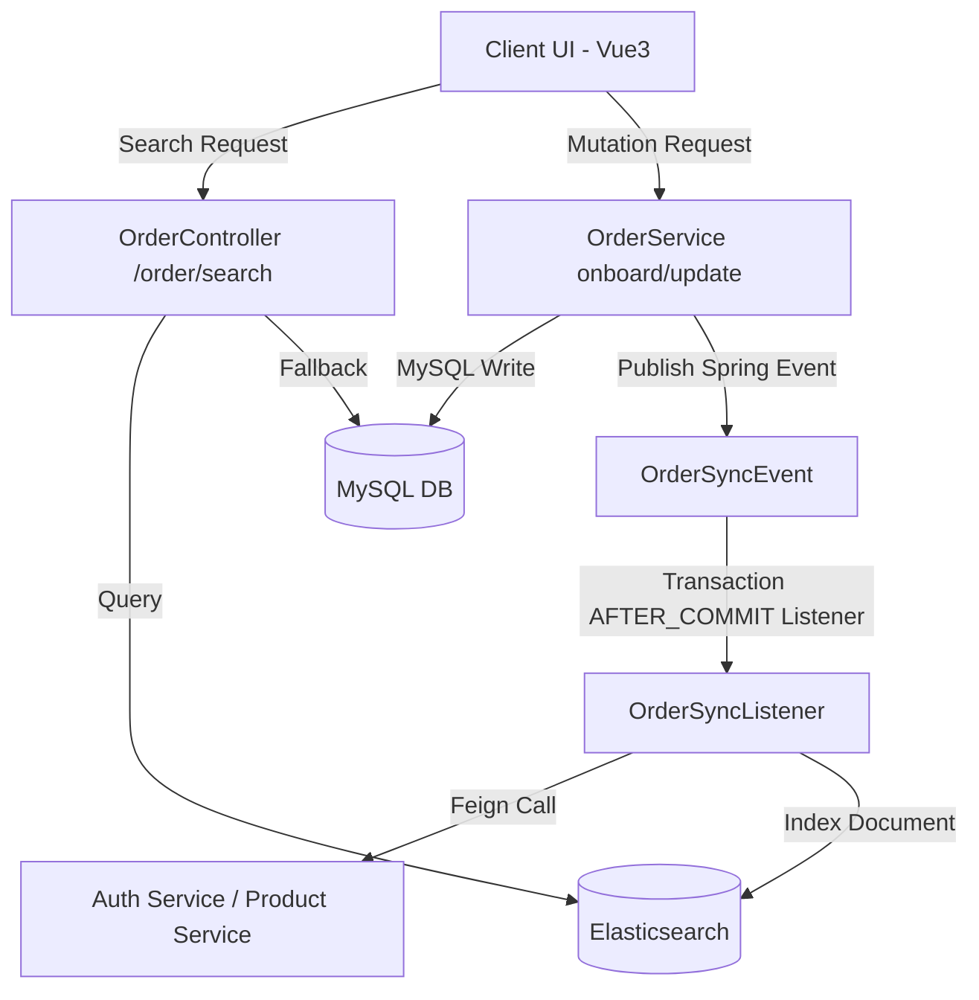

# 订单搜索与数据同步设计文档 (ES Search & Data Sync)

本文档详细记录了在 **Phase 4: High Concurrency & Idempotency Hardening** 中实现的 **MySQL N+1 查询瓶颈优化** 与 **Elasticsearch (ES) 模糊拼音检索及数据同步方案** 的架构与实现细节。

---

## 🌟 整体系统架构



---

## 🛠️ 核心架构与优化细节

### 1. MySQL N+1 查询瓶颈优化
* **核心类/接口**: `OrderController`
* **问题描述**: 原先的订单列表加载逻辑是：首先执行 1 条主 SQL 查询分页的订单列表，接着针对每一条订单数据，循环执行订单项（`OrderItem`）查询和事件投递（`OrderOutbox`）查询。这意味着如果分页返回 20 条订单，总共会产生 $1 + 20 \times 2 = 41$ 次数据库网络 IO 往返，形成严重的 N+1 瓶颈。
* **解决方案**: 
  - 通过重构控制层，将获取到的订单号（OrderNo）集聚成 Batch ID 集合。
  - 使用两次 `IN` 查询批量捞出关联的订单子项与 outbox 状态记录（即一次性拉回全部子项）。
  - 在内存中使用 Java Stream API 进行高效组合归类。
  - **优化结果**：将数据库网络 IO 次数降低为**恒定 3 次（1 次主查询 + 2 次 IN 批量查询）**，完全解耦了页面数据规模与 IO 瓶颈的关系。

### 2. Spring 事务事件驱动的数据同步 (Event-Driven Data Sync)
* **核心类/接口**: `OrderServiceImpl`, `OrderSyncListener`, `OrderApplication`
* **方案选择**: **Outbox 事务 + Spring Event 驱动的最终一致性同步** (避免核心交易路径上的同步双写风险)。
* **实现细节**:
  - 在订单的创建和状态更新写入事务中，通过 `ApplicationEventPublisher` 发布一个本地 `OrderSyncEvent`。
  - 监听器 `OrderSyncListener` 采用 Spring 的 `@TransactionalEventListener(phase = TransactionPhase.AFTER_COMMIT)` 拦截。只有在 MySQL 核心业务事务**提交成功后**，才触发异步的 ES 写入流程。
  - 在监听器内，由于 ES 需要支持模糊拼音的宽表搜索，监听器将通过 `OpenFeign`（调用 `uno-auth-service` 获取员工名字、`uno-product-service` 捞取产品系列名），把它们拍平成单文档宽表格式（`EsOrderDoc`），再写入本地 ES 集群。
  - **避坑说明**：针对 Feign 扫描范围导致的 Spring 启动报错，已在主类 `OrderApplication` 上扩展为 `@EnableFeignClients(basePackages = {"com.uno.product.api", "com.uno.order.feign"})` 以注入自定义 `AuthFeignClient`。

### 3. ES 高可用降级方案 (Resilient Fallback Strategy)
* **核心类/接口**: `OrderController` (接口 `/order/search`)
* **设计考量**: Elasticsearch 作为二级索引，可能因磁盘满、GC 停顿、网络抖动等原因导致服务不可用或报错。为了不影响主业务的连续性，订单搜索接口必须具备高可用降级能力。
* **实现细节**:
  - 接口在调用 ES Repository 查询时外围包裹 `try-catch`。
  - 一旦捕获任何来自 ES 的连接或查询异常，会立刻进行**静默降级**，自动 Fallback 至底层的 MySQL 数据库通过 `LIKE` 模糊匹配进行查询，并在日志中输出 Warn 信息。
  - 这保证了即使 Elasticsearch 停机，前端页面的搜索功能也依然可以使用，保障了服务的高可用性。

### 4. 前端 Vue3 与 Pinia 搜索组件集成
* **核心文件**: `business.ts` (Pinia), `OrderList.vue`, 国际化翻译 `zh.ts` / `en.ts`
* **实现细节**:
  - 在 Pinia Store 层的 `fetchOrders` 支持了可选的 `keyword` 和 `status` 入参。如果带有这两个参数，会自动路由到后端的 `/order/search` 接口，无参数时仍走 MySQL 列表接口，确保双通道共存。
  - 在 `OrderList.vue` 的顶部新增了极简精美的顶部搜索过滤器（`filter-bar`），包含关键词输入框和状态下拉菜单，完美无缝地适配了全局多语言翻译体系。
  - 针对 TypeScript 模板的类型兼容，使用精确类型注释规避了构建期间的 `any` 隐式校验报错，前端生产包通过 `npm run build` 构建零 Warning/Error。

---

## 🚀 启动与自测步骤

1. **一键拉起基础设施**（包含 Elasticsearch 和 Kibana 7.17.14）：
   ```bash
   cd docker
   docker compose -f docker-compose.infra.yml up -d elasticsearch kibana
   ```
2. **导入或同步 Nacos 配置**：
   运行 `./scripts/import-nacos-configs.sh`，确保 Nacos 中的配置包含最新端口 8088 相关的配置。
3. **本地启动微服务**（Auth、Product、Order、Gateway），当前网关运行在 **8088 端口**。
4. **前端启动**：
   运行 `npm run dev`，浏览器访问 `http://localhost:3000`。
5. **功能测试**：
   - 录入订单：新建一条订单，观察控制台是否触发了 AFTER_COMMIT 事务监听，并调用 Feign + 成功推送 ES 索引。
   - 模糊检索：在搜索栏输入员工姓名拼音或产品模糊词，校验 ES 搜索返回。
   - 降级测试：运行 `docker compose stop elasticsearch`，再次输入检索词，查看系统是否完美降级到 MySQL `LIKE` 模糊查询，无报错卡死。
## 📚 ES 在复杂查询与同步场景的进一步说明

**为什么可以用 ES 替代 7‑8 表的 JOIN？**
- 将业务关联表的关键字段（如员工姓名、产品名称、状态等）在业务写入 MySQL 后 **拍平成宽表文档**，写入 ES。这样查询时只需要在单个 ES 索引上做多字段过滤，天然避免了跨表 JOIN，查询延迟从秒级降到毫秒级。
- ES 支持全文、拼音、前缀、范围等复合查询，能够一次性满足页面搜索、过滤、排序等需求。

**同步的两大实现方式**
1. **事件驱动（当前实现）**：业务事务提交后触发 `OrderSyncListener`，通过 Feign 拉取关联表数据并写入 ES。适合**业务表不多、变更频率中等**的场景；但需要在每张关联表变更时显式触发同步，代码维护成本稍高。
2. **CDC + Kafka（推荐生产方案）**：使用 Canal/Debezium 监听 MySQL binlog，捕获任意表的变更并通过 Kafka 流式处理后更新 ES。优点是 **全链路解耦、实时性高、任意表变更皆可同步**，缺点是引入了额外的中间件（Canal、Kafka）和相应的运维工作。

**同步策略选择建议**
- 若业务变更频率低且关联表数量 ≤ 5，继续使用现有 **事务事件 + Feign** 实现即可。
- 若关联表增至 7‑8 张，且数据更新频繁，强烈建议迁移到 **CDC + Kafka**，配合 ES 的 `_update` 接口实现局部字段更新，确保数据一致性。

**注意事项**
- **最终一致性**：ES 与 MySQL 之间是 **最终一致**，业务层需允许几秒的同步延迟。
- **索引映射**：确保 ES 映射中对需要搜索的中文、拼音字段使用 `standard` 或 `ik_max_word` 分词器，以获得良好的模糊匹配效果。
- **监控告警**：建议在同步链路（Kafka 消费）上添加失败重试和告警，防止因网络或服务异常导致的索引缺失。

---
